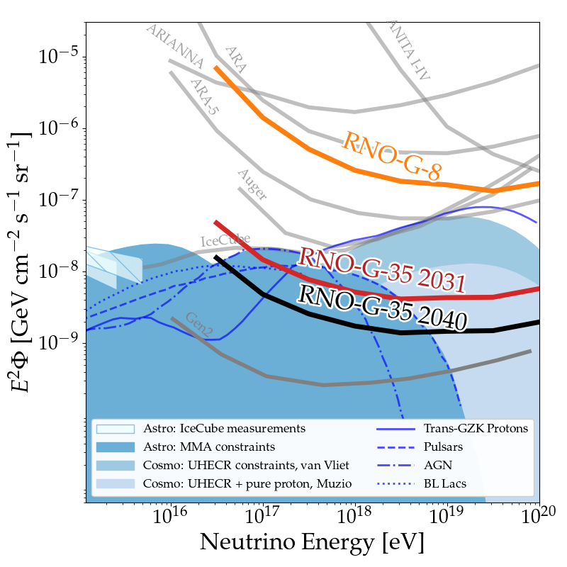
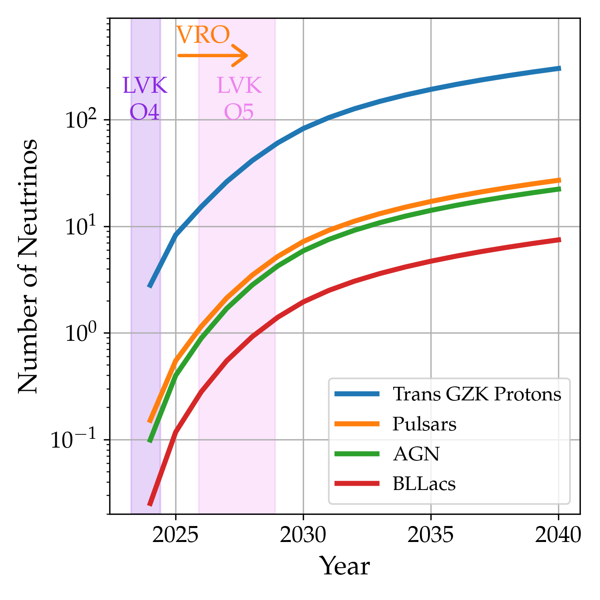

# 2025 RNO-G NSF Strategic Review

This makes the plots for the NSF strategic review.
Particularly the following two plots:

The first thing you need to do is compute the exposure of the instrument.
For the diffuse limit, we need the integrated exposure at various checkpoints (e.g. in 2040).
For the num vs time plot, we need the integrated exposure each year.
Both of these quantities are computed with `computing_stuff/compute_quantities.ipynb`.

After that, you need tor un `plot_limit/makeRNOGReviewPlot_Limit.py` and `plot_limit/makeRNOGReviewPlot_NumVsTime.py`.
Call them like `python makeRNOGReviewPlot_Limit.py`.
You *will* need a working NuRadioMC installation (along with its dependencies).